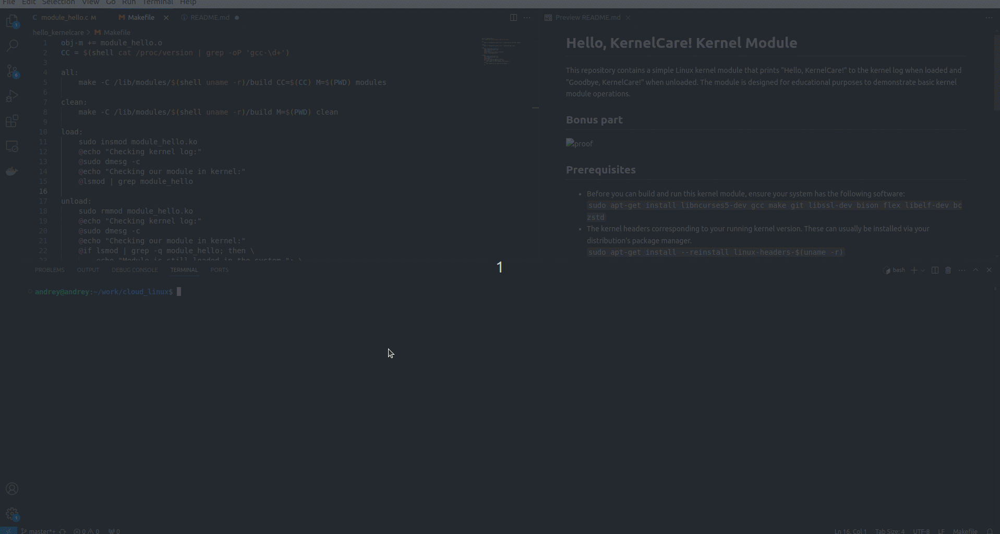

# Hello, KernelCare! Kernel Module

This repository contains a simple Linux kernel module that prints "Hello, KernelCare!" to the kernel log when loaded and "Goodbye, KernelCare!" when unloaded. The module is designed for educational purposes to demonstrate basic kernel module operations.

## Bonus part

## Prerequisites

- Before you can build and run this kernel module, ensure your system has the following software:
 `sudo apt-get install libncurses5-dev gcc make git libssl-dev bison flex libelf-dev bc zstd`
- The kernel headers corresponding to your running kernel version. These can usually be installed via your distribution's package manager.
 `sudo apt-get install --reinstall linux-headers-$(uname -r)`

## Building and Running the Module

To build the module, use the provided Makefile with the following commands from the root directory of the project:
 `make all` # Compile the module
 `sudo make load`   # Load the module into the kernel
 `sudo make unload` # Remove the module from the kernel
 `make clean`   # Remove generated files

## Testing the Module

When loading a module, you should see the line "Hello, KernelCare!" in the kernel log and your module should be visible when you call `lsmod` or `cat /proc/modules`. When unloading a module you should see the line "Goodbye, KernelCare!" and our mod should disappear from the output of the `lsmod` or `cat /proc/modules` command.

## License
This project is licensed under the GPL v2 license, as indicated by the module source file headers.